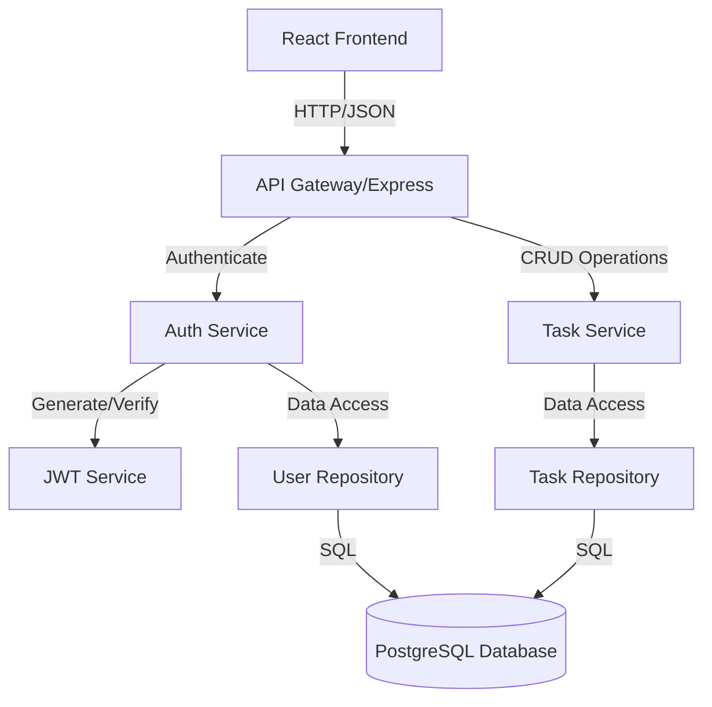
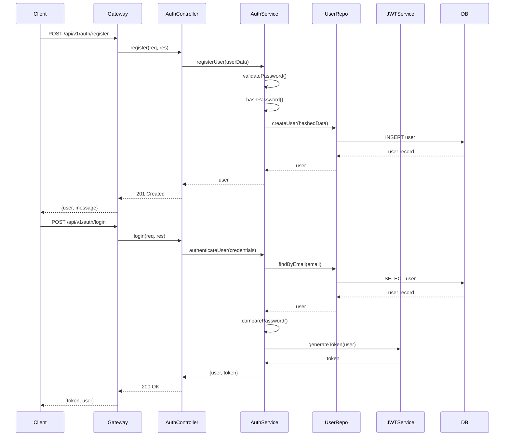
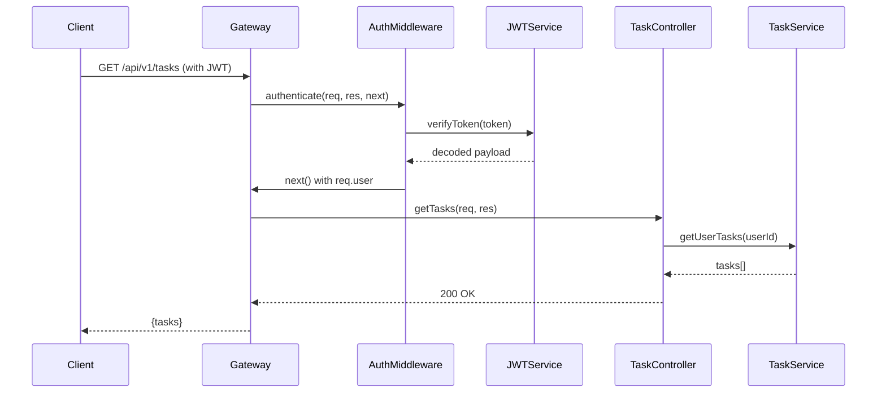

# Design Document

## Overview

The auth-crud-system is a full-stack application built with a Node.js/Express backend and React frontend. The system implements JWT-based authentication, role-based authorization, and RESTful CRUD operations for task management. The architecture follows a layered approach with clear separation of concerns, enabling scalability and maintainability.

### Technology Stack

**Backend:**
- Node.js with Express.js framework
- PostgreSQL database
- JWT for authentication
- bcrypt for password hashing
- Joi for input validation
- Swagger/OpenAPI for documentation
- Winston for logging

**Frontend:**
- React.js with React Router
- Axios for API communication
- Context API for state management
- CSS modules for styling

## Architecture

### System Architecture



### Backend Architecture Layers

1. **Routes Layer**: Defines API endpoints and maps them to controllers
2. **Middleware Layer**: Handles authentication, authorization, validation, and error handling
3. **Controller Layer**: Processes HTTP requests and responses
4. **Service Layer**: Contains business logic
5. **Repository Layer**: Handles database operations
6. **Model Layer**: Defines data structures and schemas

### Project Structure

```
backend/
├── src/
│   ├── config/
│   │   ├── database.js
│   │   ├── jwt.js
│   │   └── logger.js
│   ├── middleware/
│   │   ├── auth.js
│   │   ├── roleCheck.js
│   │   ├── validation.js
│   │   └── errorHandler.js
│   ├── routes/
│   │   ├── v1/
│   │   │   ├── auth.routes.js
│   │   │   ├── task.routes.js
│   │   │   └── index.js
│   ├── controllers/
│   │   ├── auth.controller.js
│   │   └── task.controller.js
│   ├── services/
│   │   ├── auth.service.js
│   │   ├── task.service.js
│   │   └── jwt.service.js
│   ├── repositories/
│   │   ├── user.repository.js
│   │   └── task.repository.js
│   ├── models/
│   │   ├── user.model.js
│   │   └── task.model.js
│   ├── validators/
│   │   ├── auth.validator.js
│   │   └── task.validator.js
│   ├── utils/
│   │   ├── sanitizer.js
│   │   └── apiResponse.js
│   ├── docs/
│   │   └── swagger.js
│   └── app.js
├── tests/
├── .env.example
├── package.json
└── README.md

frontend/
├── src/
│   ├── components/
│   │   ├── Auth/
│   │   │   ├── Login.jsx
│   │   │   └── Register.jsx
│   │   ├── Dashboard/
│   │   │   └── Dashboard.jsx
│   │   ├── Tasks/
│   │   │   ├── TaskList.jsx
│   │   │   ├── TaskForm.jsx
│   │   │   └── TaskItem.jsx
│   │   └── Common/
│   │       ├── ProtectedRoute.jsx
│   │       └── ErrorMessage.jsx
│   ├── context/
│   │   └── AuthContext.jsx
│   ├── services/
│   │   ├── api.js
│   │   ├── authService.js
│   │   └── taskService.js
│   ├── utils/
│   │   └── tokenStorage.js
│   ├── App.jsx
│   └── index.js
├── package.json
└── README.md
```

## Components and Interfaces

### Authentication Flow



### Protected Request Flow



### API Endpoints

#### Authentication Endpoints

| Method | Endpoint | Description | Auth Required | Role |
|--------|----------|-------------|---------------|------|
| POST | /api/v1/auth/register | Register new user | No | - |
| POST | /api/v1/auth/login | Login user | No | - |

#### Task Endpoints

| Method | Endpoint | Description | Auth Required | Role |
|--------|----------|-------------|---------------|------|
| POST | /api/v1/tasks | Create task | Yes | User/Admin |
| GET | /api/v1/tasks | Get user tasks | Yes | User/Admin |
| GET | /api/v1/tasks/:id | Get task by ID | Yes | User/Admin |
| PUT | /api/v1/tasks/:id | Update task | Yes | User/Admin |
| DELETE | /api/v1/tasks/:id | Delete task | Yes | User/Admin |
| GET | /api/v1/tasks/all | Get all tasks (admin) | Yes | Admin |

## Data Models

### User Model

```javascript
{
  id: UUID (Primary Key),
  email: String (Unique, Not Null),
  password: String (Hashed, Not Null),
  role: Enum['user', 'admin'] (Default: 'user'),
  createdAt: Timestamp,
  updatedAt: Timestamp
}
```

**Database Schema (PostgreSQL):**

```sql
CREATE TABLE users (
  id UUID PRIMARY KEY DEFAULT gen_random_uuid(),
  email VARCHAR(255) UNIQUE NOT NULL,
  password VARCHAR(255) NOT NULL,
  role VARCHAR(20) DEFAULT 'user' CHECK (role IN ('user', 'admin')),
  created_at TIMESTAMP DEFAULT CURRENT_TIMESTAMP,
  updated_at TIMESTAMP DEFAULT CURRENT_TIMESTAMP
);

CREATE INDEX idx_users_email ON users(email);
```

### Task Model

```javascript
{
  id: UUID (Primary Key),
  title: String (Not Null),
  description: Text (Not Null),
  status: Enum['pending', 'in_progress', 'completed'] (Default: 'pending'),
  userId: UUID (Foreign Key -> users.id),
  createdAt: Timestamp,
  updatedAt: Timestamp
}
```

**Database Schema (PostgreSQL):**

```sql
CREATE TABLE tasks (
  id UUID PRIMARY KEY DEFAULT gen_random_uuid(),
  title VARCHAR(255) NOT NULL,
  description TEXT NOT NULL,
  status VARCHAR(20) DEFAULT 'pending' CHECK (status IN ('pending', 'in_progress', 'completed')),
  user_id UUID NOT NULL REFERENCES users(id) ON DELETE CASCADE,
  created_at TIMESTAMP DEFAULT CURRENT_TIMESTAMP,
  updated_at TIMESTAMP DEFAULT CURRENT_TIMESTAMP
);

CREATE INDEX idx_tasks_user_id ON tasks(user_id);
CREATE INDEX idx_tasks_created_at ON tasks(created_at DESC);
```

### JWT Token Payload

```javascript
{
  userId: UUID,
  email: String,
  role: String,
  iat: Number (issued at),
  exp: Number (expiration - 24 hours)
}
```

## Middleware Components

### Authentication Middleware

**Purpose**: Verify JWT token and attach user information to request

**Implementation**:
```javascript
// Pseudo-code
function authenticate(req, res, next) {
  // Extract token from Authorization header
  // Verify token using JWT service
  // If valid, attach decoded user to req.user
  // If invalid, return 401 Unauthorized
  // Call next() to proceed
}
```

### Role Check Middleware

**Purpose**: Verify user has required role for endpoint access

**Implementation**:
```javascript
// Pseudo-code
function requireRole(allowedRoles) {
  return function(req, res, next) {
    // Check if req.user.role is in allowedRoles
    // If yes, call next()
    // If no, return 403 Forbidden
  }
}
```

### Validation Middleware

**Purpose**: Validate request body against schema

**Implementation**:
```javascript
// Pseudo-code
function validate(schema) {
  return function(req, res, next) {
    // Validate req.body against Joi schema
    // If valid, call next()
    // If invalid, return 400 Bad Request with field errors
  }
}
```

### Input Sanitization

**Purpose**: Prevent injection attacks

**Implementation**:
- Trim whitespace from strings
- Escape HTML special characters
- Remove SQL injection patterns
- Apply to all user inputs before processing

## Error Handling

### Error Response Format

```javascript
{
  success: false,
  error: {
    code: String,        // e.g., "VALIDATION_ERROR", "UNAUTHORIZED"
    message: String,     // User-friendly error message
    details: Object      // Optional: field-specific errors
  }
}
```

### HTTP Status Codes

- 200 OK: Successful GET, PUT requests
- 201 Created: Successful POST requests
- 204 No Content: Successful DELETE requests
- 400 Bad Request: Validation errors
- 401 Unauthorized: Missing or invalid authentication
- 403 Forbidden: Insufficient permissions
- 404 Not Found: Resource not found
- 409 Conflict: Duplicate resource (e.g., email exists)
- 500 Internal Server Error: Server-side errors

### Error Handling Middleware

```javascript
// Pseudo-code
function errorHandler(err, req, res, next) {
  // Log error with Winston
  // Determine error type and status code
  // Format error response
  // Return appropriate status code and error object
  // Never expose stack traces in production
}
```

## Security Implementation

### Password Security

- Use bcrypt with salt rounds of 10
- Validate password strength: minimum 8 characters, uppercase, lowercase, number
- Never store plain text passwords
- Never return password in API responses

### JWT Security

- Sign tokens with strong secret key (stored in environment variables)
- Set expiration to 24 hours
- Validate signature on every protected request
- Include minimal necessary information in payload
- Use HTTPS in production to prevent token interception

### Input Validation & Sanitization

- Validate all inputs using Joi schemas
- Sanitize inputs to prevent XSS and SQL injection
- Use parameterized queries for database operations
- Implement rate limiting to prevent brute force attacks

### CORS Configuration

- Configure CORS to allow only trusted frontend origins
- Set appropriate headers for security

### Environment Variables

- Store sensitive configuration in .env file
- Never commit .env to version control
- Provide .env.example template

## Frontend Design

### Component Structure

**AuthContext**: Manages authentication state globally
- Stores JWT token and user information
- Provides login, logout, and register functions
- Persists token in localStorage

**ProtectedRoute**: Wrapper component for authenticated routes
- Checks for valid token
- Redirects to login if unauthenticated

**Login Component**: User login form
- Email and password inputs
- Form validation
- Error message display
- Redirects to dashboard on success

**Register Component**: User registration form
- Email and password inputs
- Password confirmation
- Form validation
- Success message and redirect to login

**Dashboard Component**: Main authenticated view
- Displays user information
- Shows TaskList component
- Logout button

**TaskList Component**: Displays all user tasks
- Fetches tasks on mount
- Shows TaskForm for creating new tasks
- Maps tasks to TaskItem components
- Handles pagination

**TaskForm Component**: Create/edit task form
- Title and description inputs
- Status dropdown
- Submit handler
- Validation

**TaskItem Component**: Individual task display
- Shows task details
- Edit and delete buttons
- Inline editing capability

### API Service Layer

**api.js**: Axios instance with interceptors
- Base URL configuration
- Request interceptor to attach JWT token
- Response interceptor to handle 401 errors (logout)

**authService.js**: Authentication API calls
- register(userData)
- login(credentials)
- logout()

**taskService.js**: Task API calls
- getTasks(page, limit)
- getTaskById(id)
- createTask(taskData)
- updateTask(id, taskData)
- deleteTask(id)

### Token Storage

- Store JWT in localStorage
- Retrieve token for API requests
- Clear token on logout or 401 errors
- Validate token expiration on app load

## Testing Strategy

### Backend Testing

**Unit Tests**:
- Service layer functions (business logic)
- Utility functions (sanitization, validation)
- JWT service (token generation/verification)
- Password hashing and comparison

**Integration Tests**:
- API endpoint testing with supertest
- Database operations with test database
- Authentication flow end-to-end
- CRUD operations end-to-end
- Role-based access control

**Test Coverage Goals**:
- Minimum 70% code coverage
- Focus on critical paths (auth, CRUD)

### Frontend Testing

**Component Tests**:
- Form validation logic
- Protected route behavior
- Error message display
- API service functions

**Integration Tests**:
- User registration flow
- Login and token storage
- Task CRUD operations
- Logout and token clearing

## API Documentation

### Swagger/OpenAPI Implementation

- Define OpenAPI 3.0 specification
- Document all endpoints with:
  - Request parameters
  - Request body schemas
  - Response schemas
  - Status codes
  - Authentication requirements
- Serve Swagger UI at /api-docs
- Include example requests and responses
- Group endpoints by resource (Auth, Tasks)

### Documentation Structure

```yaml
openapi: 3.0.0
info:
  title: Auth CRUD System API
  version: 1.0.0
  description: RESTful API for authentication and task management

servers:
  - url: http://localhost:3000/api/v1

components:
  securitySchemes:
    bearerAuth:
      type: http
      scheme: bearer
      bearerFormat: JWT

paths:
  /auth/register:
    post:
      summary: Register new user
      tags: [Authentication]
      requestBody: ...
      responses: ...
  
  /tasks:
    get:
      summary: Get user tasks
      tags: [Tasks]
      security:
        - bearerAuth: []
      responses: ...
```

## Scalability Considerations

### Horizontal Scaling

- Stateless API design (no server-side sessions)
- JWT tokens eliminate need for session storage
- Database connection pooling for concurrent requests
- Load balancer can distribute requests across multiple instances

### Database Optimization

- Indexes on frequently queried columns (email, user_id, created_at)
- Connection pooling to reuse database connections
- Prepared statements to prevent SQL injection and improve performance

### Caching Strategy (Optional Enhancement)

- Redis for caching frequently accessed data
- Cache user information after authentication
- Cache task lists with TTL
- Invalidate cache on data updates

### Logging and Monitoring

- Winston for structured logging
- Log levels: error, warn, info, debug
- Log all API requests with response times
- Log all errors with stack traces
- Separate log files for different levels

### Environment Configuration

- Development: Local database, verbose logging
- Staging: Cloud database, moderate logging
- Production: Cloud database, error-only logging, HTTPS enforced

### Docker Deployment (Optional)

- Dockerfile for backend
- Dockerfile for frontend
- docker-compose.yml for local development
- Separate containers for app and database
- Environment-specific compose files

### Future Enhancements

- Microservices architecture: Separate auth and task services
- Message queue for async operations
- Rate limiting with Redis
- API gateway for request routing
- Database replication for read scalability
- CDN for frontend assets
